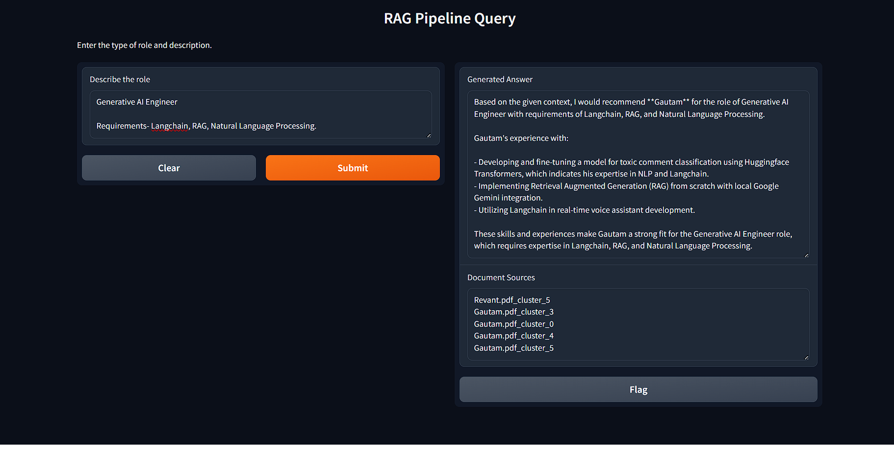

# Document Retrieval Application with FAISS and Sentence Transformers

This project implements a document retrieval system that utilizes a combination of BM25, FAISS indexing, and sentence transformers. The application allows users to upload documents and retrieve relevant results using a Retrieval-Augmented Generation (RAG) pipeline for interactive queries.

## Table of Contents

1. [Project Overview](#project-overview)
2. [Features](#features)
3. [Technologies and Libraries Used](#technologies-and-libraries-used)
4. [Project Structure](#project-structure)
5. [Setup and Installation](#setup-and-installation)
6. [Usage](#usage)
7. [Methodology](#methodology)
8. [Models Used](#models-used)

## Project Overview

This application is designed to perform efficient document retrieval with hybrid search capabilities, integrating both traditional methods like BM25 and modern deep learning-based embeddings using FAISS. Users can upload Resumes and perform real-time searches, with results enhanced by a RAG pipeline.

## Features

- Document ingestion and processing pipeline
- Hybrid search:
  - BM25-based sparse retrieval
  - FAISS-based dense retrieval using sentence transformers
- FastAPI backend for handling document retrieval queries
- Gradio-based user interface for interactive querying
- PDF processing for document uploads
- Retrieval-Augmented Generation (RAG) pipeline for enhanced query results

## Technologies and Libraries Used

- **Backend**:
  - FastAPI: For building the backend server and endpoints
  - FAISS: For dense vector search and indexing
  - Sentence Transformers: For creating document embeddings
  - PyPDF2: For PDF processing
  - Uvicorn: ASGI server for FastAPI

- **Frontend**:
  - Gradio: Interactive UI for querying and retrieving documents

- **Utilities**:
  - BM25: For traditional sparse retrieval
  - NumPy: For numerical operations
  - Python Standard Libraries

## Project Structure

```
AC-Assignment/ 
├── pycache/ 
├── docs/ │
 ├── Gautam.pdf │
 └── Revant.pdf 
├── .env 
├── chunking.py 
├── gradio-app.py 
├── README.md 
└── server.py

```

## Setup and Installation

1. Clone the repository:
   ```bash
   git clone <repository-url>
   ```
2. Install the requirements:
    ```bash
    pip install -r requirements.txt
    ```
3. Set up the environment variables in the .env file:
    ```
    GROQ_API_KEY= "<your-api-key>"
    ```
## Usage

1. Add your documents to the docs Folder.

2. Start the backend server:

   ```bash
   uvicorn server:app --host 0.0.0.0 --port 8000 --reload
   ```
3. Open the Gradio interface by running:
    ` python gradio-app.py `

## Methodology

1. **Document Ingestion**: PDF documents are uploaded through the Gradio interface and processed using `PyPDF2` to extract text.

2. **Indexing**:
   - **BM25**: The traditional BM25 algorithm is used for sparse document retrieval.
   - **FAISS**: Sentence embeddings are created using a sentence transformer model, which are then indexed using FAISS for dense retrieval.

3. **Query Processing**: Users input their queries through the Gradio interface, which are processed in real-time. The backend retrieves relevant results using a hybrid approach of BM25 and FAISS.

4. **Retrieval-Augmented Generation (RAG)**: The top results are further refined using RAG to enhance the relevance of the search results.

## Usage Example



